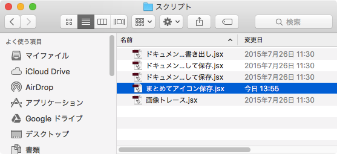
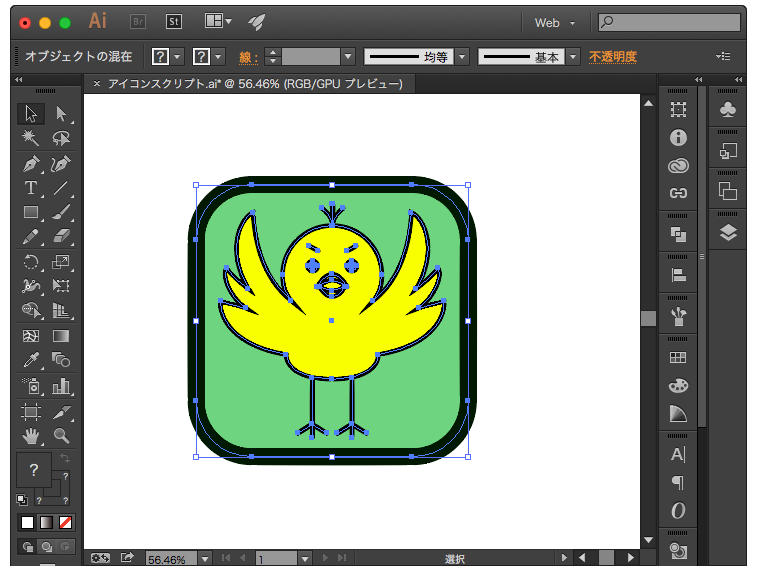
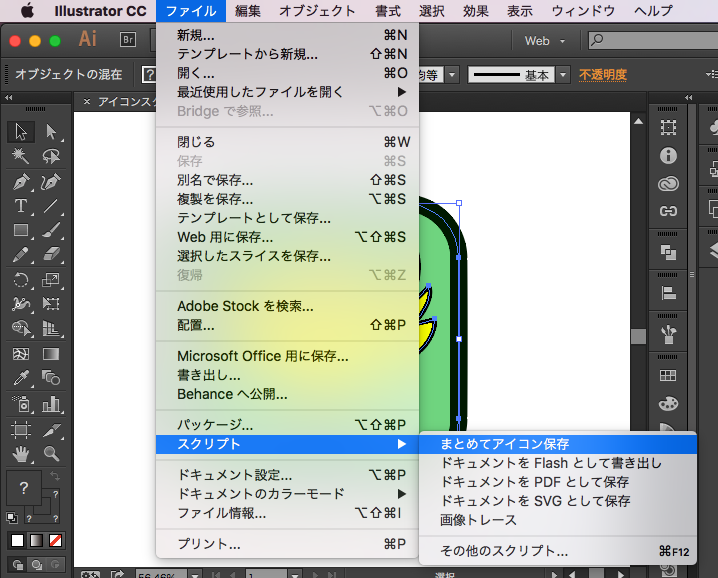
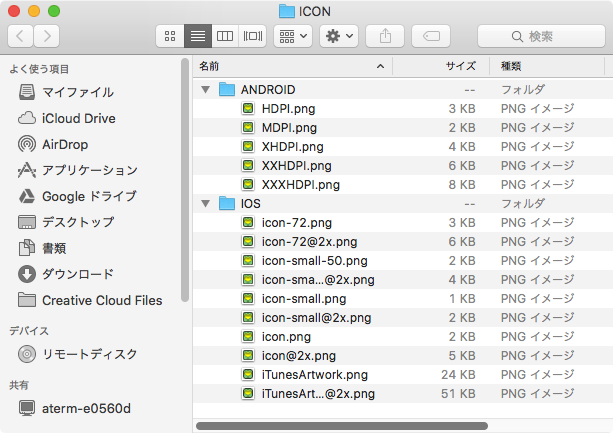

# illustrator-save-icons-for-mobile
Adobe Illustrator用スクリプト。選択オブジェクトをiOS、Android用アイコンサイズに一括書き出し。

# 使い方

## スクリプトの配置

1. save-icons-for-mobile.jsxを下記フォルダに保存

    名前はわかりやすく変えてOK。（例：まとめてアイコン保存.jsx）

* MAC
    * /アプリケーション/Adobe Illustrator CC 2015/Presets/ja_JP/スクリプト/
* Windows
    * C:/Program Files/Adobe/Adobe Illustrator CS2/プリセット/スクリプト/

  

## スクリプトの実行

1. スクリプト配置後は一度 *Adobe Illustrator* を再起動

1. アイコンとして保存したいオブジェクトを選択
  

1. メニューから *ファイル->スクリプト->保存したスクリプト* を選択
  

1. 保存先を聞かれるので任意のフォルダを選択

1. 完了。各サイズに自動変換された画像が保存される。
  
